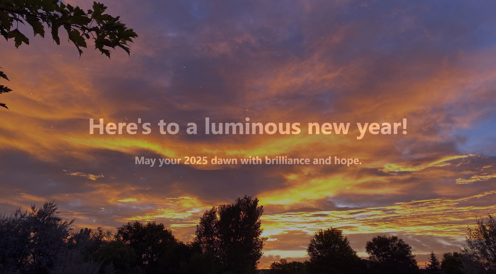

# Happy Holidays 2024

## Table of Contents

* [Description](#description)
* [Links](#links)
* [Screenshot](#screenshot)
* [Installation Instructions](#installation-instructions)
* [Usage](#usage)
* [Technologies Used](#technologies-used)
* [Tests](#tests)
* [Credits](#credits)
* [Contributing](#contributing)
* [Questions](#questions)
* [Badges](#badges)

## Description

This is a simple little React-based "Happy Holidays" e-card.

## Links

[Deployed application on GitHub Pages](https://lauracole1900.github.io/holiday-ecard-2024/)

## Screenshot

Happy Holidays:

## Installation Instructions

npm install

## Usage

This project is intended to be used to wish you "happy holidays."

## Technologies Used

 

## Tests

npm run test

## Credits

"Twinkling Night Sky" animation created by [Sharna Hossain](https://codepen.io/sharnajh) and found [here](https://codepen.io/sharnajh/pen/WNvppRy)

Star favicon by [Iconpacks](https://iconpacks.net/?utm_source=link-attribution&utm_content=7224)

Photographs copyright © [Laura E. Cole](https://lcolearts.com)

## Contributing

N/A

## Questions

If you have further questions, you can reach me at lauracole1900@comcast.net. For more of my work, see [my GitHub](https://github.com/LauraCole1900).

## Badges

